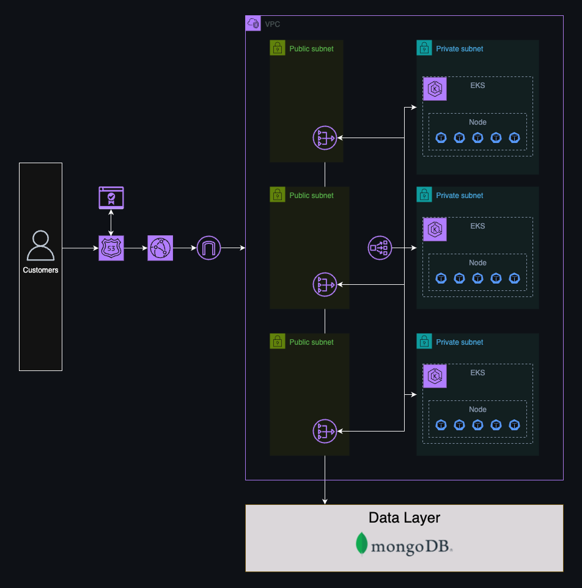

# Infrastructure as Code for an EKS Cluster using Managed Node Groups
A managed node EKS cluster running in a VPC with egress capabilities to a MongoDB database.

(https://github.com/robertdippolito/eks-infrastructure-iac/actions/workflows/deploy-k8s-api-infra.yaml)

## Table of Contents
- [About](#-about)
- [Getting Started](#-getting-started)
- [Network Architecture](#-network)
- [Ingress Architecture](#-ingress)
- [Feedback and Contributions](#-feedback-and-contributions)
- [License](#-license)
- [Contacts](#%EF%B8%8F-contacts)

## 🚀 About
This repository is part of a multi-repository experiment designed to test Kubernetes clusters under load under different scenarios. As much as possible, this cluster was designed to be easily spun up and spun down via Github Actions to optimize cost. Further testing and development on this repository is encouraged, if you notice any issues feel free to open a PR.

Videos related to this repository can be found here:

## 🔥 Getting Started
This repository is designed to be spun up with very little additional configuration. That being said, there is still a few things that must be set up beforehand. This section describes those things. 
> [!IMPORTANT]
> Running a managed node EKS cluster with 2 nodes (t3.mediums) and an ingress through CloudFront and a network load balancer will cost approximately $3.00 per day (if idle). Please remember to spin down your resources when you're done testing. If you're using the remote workflow (Github Actions) make sure you correctly configure a remote backend or destroying will be messy.
### Prerequisites 
Set up your repo secrets (alternately, you can define these locally)
|Repo Secret Key|Description|
|:-|:-|
|AWS_ACCESS_KEY_ID|AWS Key ID - ensure the role used is scoped appropriately|
|AWS_SECRET_ACCESS_KEY|AWS Secret Access Key ID - ensure the role used is scoped appropriately|
|AWS_REGION|The region that your profile will assume|

### Standalone Infrastructure
To stay true to the initial design principal (easy to spin up and down), the following AWS resources **already** should already exist in your cluster. 
|AWS Resource|Description|Configuration|
|:-|:-|:-|
|ECR Repository|Used to host the images of our API|Default configuration|
|DNS Hosted Zone|Used to house our DNS records and manage our certificates|This becomes annoying to deploy each time due to the DNS validation that needs to occur each time which creates inconsistent applys|

In addition to having an AWS account with credentials you'll need a domain name. For the experiments in this lab we use the api.anytimeagile.com domain. This is a purchased asset that is configured within our hosted zone. This is not a required step. The lab can be stood up without one, your api would just be served via http instead of https (there may be some CloudFront config changes required)
### TFVars
|Variable|Example Value|Commentary|
|:-|:-|:-|
|backend_bucket|terraform-state-bucket-api|The name of the remote state bucket|
|backend_bucket_key|eks-iac|The key used to store the state `<key>/terraform.tfstate`|
|cluster_name|my-eks-cluster|The name assigned to your EKS cluster|
|node_group_name|my-eks-managed-nodes|The name assigned to your EKS managed node group|
|ec2_ssh_key|eks-kvp|The name of your key value pair for your EC2 machines|
|aliases|yourdomain.com|The domain you want to redirect to your CloudFront|
|zone_name|yourdomain.com|The domain assigned to your hosted zone|
|domain_name|api.yourdomain.com|The specific prefix you want to redirect from e.g. api.yourdomain.com|

An example file named `terraform.tfvars.example` is provided with these values pre-populated.

## Network Architecture

## Cluster Architecture

## 📃 License 
As much as possible I'd like to encourage participation and collaboration. This code is open-source software licensed under [Apache 2.0 License](https://github.com/gowebly/gowebly/blob/main/LICENSE), created and supported by [Robert D'Ippolito](https://robertdippolito.me) for people and robots.

## 🗨️ Contacts
The best way to get in touch is via a Github issue or PR. You can also get in touch via my blog here: [https://robertdippolito.me](https://robertdippolito.me/)
